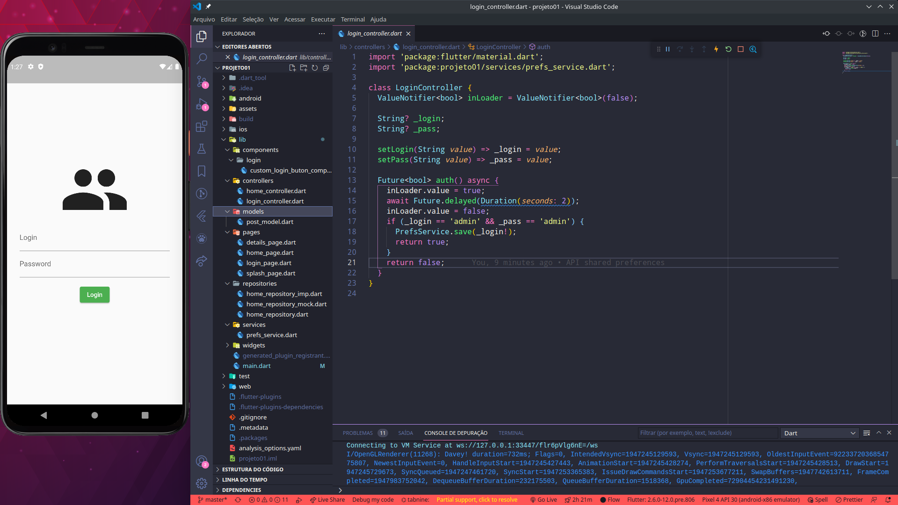

<h1 align="center">
   
  <br />
  <br />
   Flutter | http API  
</h1>

## :bookmark: Resume
<br />
Creation of a project with splash and login page using the principles of the repository pattern, which consumes a list of local json objects, decodes, and displays one of their indexes on the home page through a controller.
<br />

## :bulb: Contents covered
<br />

- Flutter
- Dio API
- Repository Pattern

<br />

## :wrench: Putting the project to run

```
First, correctly configure the Flutter development environment on your maruina, see: https://flutter.dev/docs/get-started/install

- Clone this repository:
$ git clone https://github.com/JhonataAugust0/a_sync2.git

- Enter the directory:
$ cd a_sync2

- Install dependencies:
$ flutter pub get

- Launch the app: 
$ flutter run
```

<br />

## :memo: License

This project is under the [MIT license](LICENSE) for more details.
<br />
<br />

## :wave: Social

Follow @Jhonata on the networks :wink:
<br />

- [LinkedIn](https://www.linkedin.com/in/jhonata-augusto-2301541b5/)

